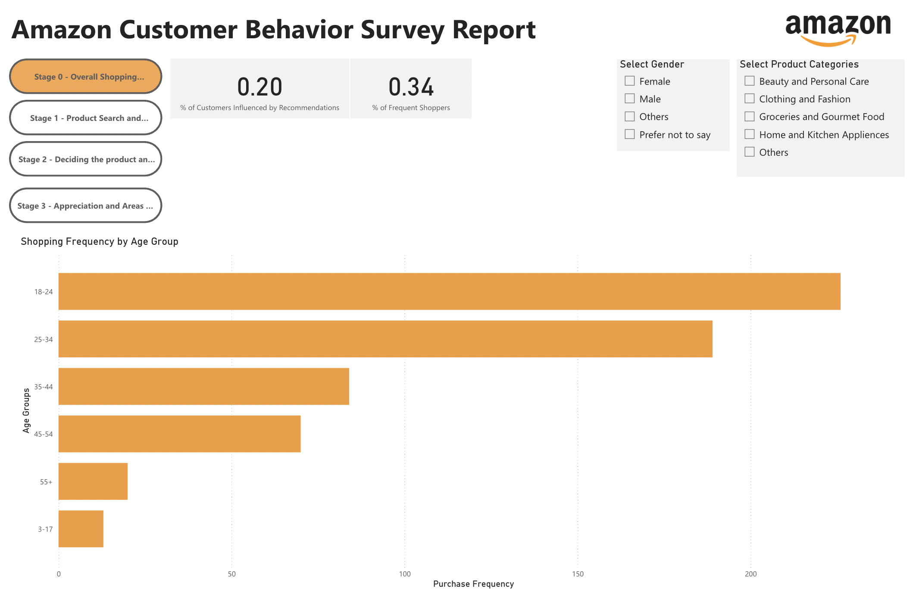
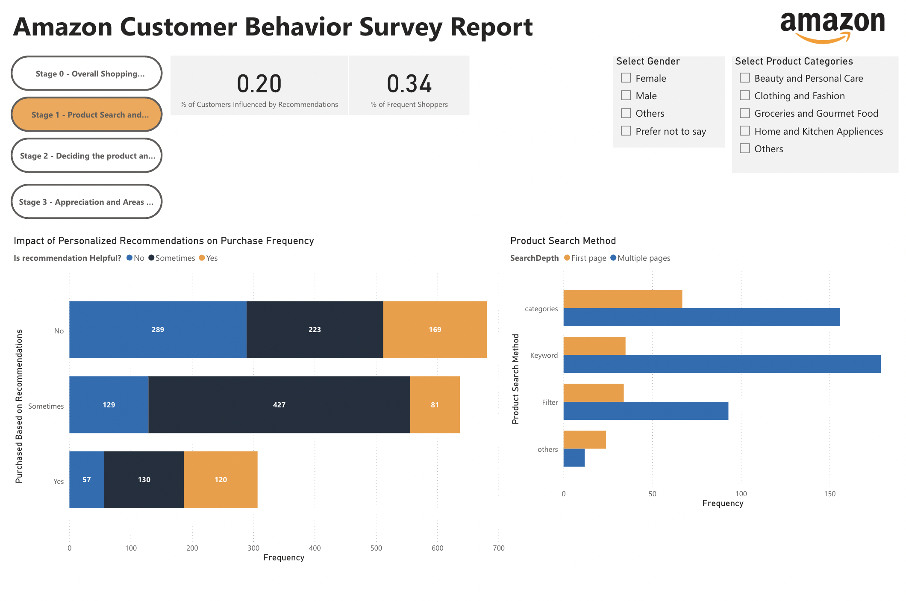
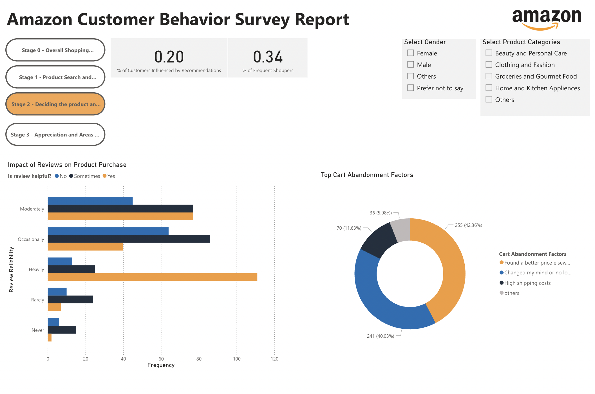
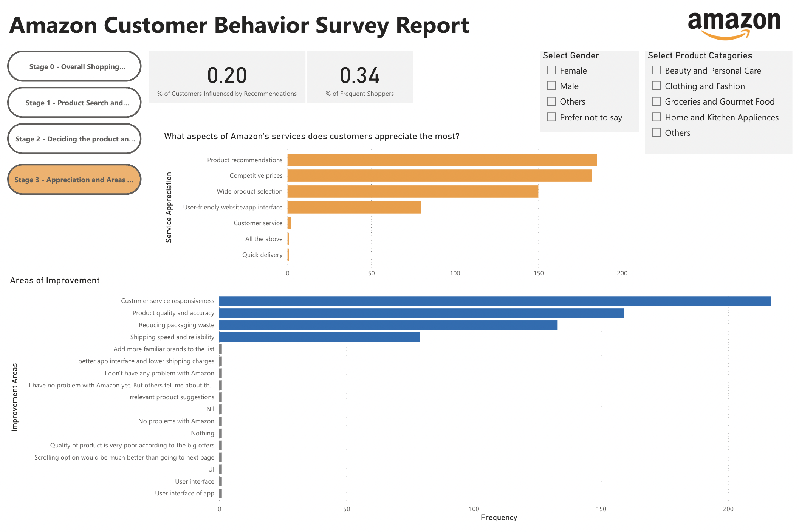

# 📊 Amazon Customer Behavior Dashboard

This interactive dashboard analyzes Amazon customer behavior across four key stages of the shopping journey. Built as part of an information visualization project, it provides insights into user engagement, product search patterns, purchase decisions, and service feedback based on survey data.

---

## 🛒 Project Overview

The dashboard presents a narrative in **4 stages**, each capturing a different aspect of the customer experience:

### 1. Overall Shopping Frequency by Age Group
Visualizes how frequently different age groups shop on Amazon, helping identify the most active customer segments.

---

### 2. Product Search Behavior
Shows how users search for products—by keyword, category, filters—and how deep they go into search pages.

---

### 3. Impact of Recommendations & Reviews on Purchase Decisions
Analyzes how personalized recommendations and customer reviews influence purchase decisions.

---

### 4. Customer Appreciation & Areas of Improvement
Highlights what customers value most (e.g., delivery speed, app interface) and suggests potential areas for service enhancement.

---

## 📈 Key Features

- Interactive visualizations using survey data
- User-friendly layout for effective storytelling
- Covers all critical stages of customer behavior
- Supports better decision-making through data-driven insights

## 🧠 Insights Gained

- Majority of frequent shoppers fall in the 25–34 age group.
- Keyword search and first-page results dominate user behavior.
- Personalized recommendations significantly increase purchase likelihood.
- Customers appreciate speed, pricing, and app interface, but seek improvements in product quality and customer support.

---

## 📌 Tools Used

- Power BI for interactive dashboard creation
- Microsoft Excel for initial data cleaning
- Survey data collected via Google Forms

